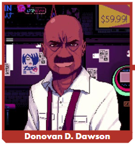
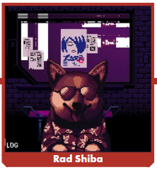

# 술을 섞는다, 인생을 바꾼다

사이버펑크 레드 / VA-11 HALL-A 크로스 오버

## VA-11 HALL-A가 뭐죠?

VA-11 HALL-A는 제작자의 말에 따르면 "외부, 기술 및 디스토피아 이후의 삶에 대한 술을 마시는 게임"입니다. 쉽게 말하면 VA-11 HALL-A는 다양한 플랫폼에서 사용할 수 있는 비디오 게임입니다. Glitch City로 알려진 사이버펑크 대도시를 배경으로 한 비주얼 노벨입니다. VA-11 HALL-A는 Megacorp의 음모와 하드보일드 거리 용병의 일에 초점을 맞추는 대신, 유명 시설의 바텐더인 Julianne "Jill" Stingray가 음료를 섞고 고객과 소통하는 과정에 초점을 맞춥니다. , 청구서를 지불하려고 노력하고 과거의 유령을 처리합니다. Sukeban Games가 2016년에 처음 출시한 VA-11 HALL-A는 "크게 만들되 개인적으로 유지하라"는 고전 격언을 기억하여 독특한 사이버펑크 세계를 선사합니다. 몇 년이 지난 지금도 팬들은 인터넷에서 타이핑을 하며 설정과 스토리, 캐릭터를 분석하며 괴짜 딥다이빙을 하고 있습니다. 그 팬들 중에는요? 마이크 폰드스미스(Mike Pondsmith)와
사이버펑크 RED 팀도 있죠. VA-11 HALL-A를 아직 플레이해보지 않으셨다면 꼭 플레이해보시길 추천드립니다. 이 게임은 (이 글을 쓰는 시점에서) Steam, Switch, PlayStation을 포함한 다양한 플랫폼에서 다운로드할 수 있습니다.

## Cyberpunk red가 뭐죠?

VA-11 HALL-A 팬덤을 통해 오셨고 Cyberpunk RED를 모르신다면 환영합니다! 무엇보다도 Cyberpunk RED는 뿌리 깊은 테이블탑 롤플레잉 게임의 최신 버전입니다. 1988년 Cyberpunk로 처음 출시되었고 1990년 Cyberpunk 2020으로 새 버전으로 다시 출시되었습니다. 그 이후로 프랜차이즈로 성장했습니다. CD Projekt Red이 만든 스트셀러 비디오 게임 사이버펑크 2077 와 수상 경력이 빛나는 애니메이션Cyberpunk: Studio Trigger의 Edgerunners의 원작입니다.

Cyberpunk RED는 애니메이션과 비디오 게임의 고전적인 2020년대 시대와 2070년대 시대의 대략 중간쯤인 2045년의 나이트 시티(그리고 크게는 어두운 미래)의 이야기를 들려줍니다. 더 중요한 것은, Cyberpunk RED를 사용하면 파괴적인 글로벌 기업 전쟁 이후 마침내 재건된 세상에서 Edgerunner가 생존하기 위해 고군분투하는 동안 자신만의 이야기를 들려줄 수 있습니다. 이 보충 자료를 독서 자료 이외의 다른 용도로 사용하려면 해당 책의 사본을 소유해야 합니다. Cyberpunk RED 핵심 룰북은 DriveThruRPG에서 디지털 방식으로, 당사 웹스토어와 전 세계 친숙한 지역 게임 매장에서 물리적으로 구할 수 있습니다.

## 신이시여 이게 뭐죠?

Mixing Drinks–Changing Lives는 다음과 같은 간단한 질문을 전제로 한 보충 자료입니다. VA-11 HALL-A 바, 직원 및 고객이 Cyberpunk RED의 중심 설정인 Night City에 존재한다면 어떨까요? 사립 탐정 및 보안 기관인 Danger Gal의 프리랜서 분석가의 렌즈를 통해 기준을 조사합니다(Danger Gal Dossier 보충 자료에서 이전에 설정한 형식). 또한 이 혼합 세계에서 VA-11 HALL-A의 모회사인 Hammered Industries와 새로운 장비 및 사이버웨어에 대한 정보를 제공합니다. VA-11 HALL-A에 이미 익숙하다면 Cyberpunk의 공식설정 내에서 작동하도록 조정했다는 점을 알아두시기 바랍니다. 예를 들어 Lilim은 Night City에 존재하지 않으며 보편적인 나노머신 감염도 없습니다. 우리가 해야 했던 부분에서는 현실 슬라이더를 Glitch City에서 어두운 미래 쪽으로 조정하여 상황이 약간 다르게 보일 수 있도록 했습니다.

## 이건 공식 설정인가요?

아니요! 천만에요! **Mixing Drinks–Changing Lives**의 자료는 Night City에 VA-11 HALL-A, 직원 및 고객의 변형이 존재하는 대체 우주를 제시합니다. 공식 설정 상 **VA-11 HALL-A**에서 이야기는 여전히 207X경 Glitch City에서 펼쳐집니다. 공식 설정 상 **사이버펑크 레드**에는 VA-11 HALL-A라는 이름의 바가 없습니다. 이 기사는 VA-11 HALL-A와 그 컨셉,그리고 캐릭터를 **사이버펑크 레드** 환경에 맞게 변형시킨 두 프랜차이즈의 대체 우주를 나타냅니다.

우리는 뒤에 있는 사람들을 위해 다시 외칠 것입니다. **Mixing Drinks–Changing Lives**의 어떤 것도 공식설정이 아닙니다. VA-11 HALL-A는 Sukeban Games의 공식 제품에도 자료가 나타나지 않는 한 그렇습니다. 마찬가지로, R. Talsorian Games 또는 CD Projekt Red의 공식 제품에도 등장하지 않는 한 여기에 있는 어떤 것도 더 큰 사이버펑크 세계의 정경이 아닙니다.

하지만 그것은 모두 당신의 어두운 미래에 대한 표준이 될 수 있습니다! Cyberpunk RED 게임에 원하는 것을 무엇이든 연결할 수 있습니다. 계속하세요. 우리는 괜찮다고 약속합니다.

>**감시관 참고 사항**: von Delay는 믿을 만한 프리랜서이지만, 그가 우리에게 장난을 치고 있거나 누군가가 그의 보고서를 해킹했습니다. 나는 서류 전반에 걸쳐 메타데이터로 묻혀 있는 색상 해설을 발견했습니다. 분석을 위해 기술팀에 파일을 전달했고 보고를 위해 von Delay에 전화했습니다.
>>`—Tag Ophelia Nist, 분석가 팀 NC-1 리드`

나이트 시티에서는 온갖 형태의 잔인함이 일상의 현실입니다. 권력이 없는 사람들의 삶의 질은 놀라운 속도로 감소합니다. 많은 사람들에게 이것은 부담스러울 수 있습니다. 어떤 사람들은 탈출할 방법을 찾습니다. 다른 사람들은 그냥 포기합니다. 그리고 많은 사람들에게 답은 유리잔 바닥에 있습니다.

 메인 스트리트에서 불과 조금 떨어진 작은 길, 빈민가 근처 어딘가에 Hammered Industry 프랜차이즈 바의 홀 A, VA-11을 찾을 수 있습니다. 하지만 단골들은 그것을 발할라라고 발음합니다. 콘크리트 사막 한가운데에 있는 작은 오아시스. 지친 영혼을 기다리는 영혼의 샘. 
 
 언뜻 보기에 VA-11 HALL-A는 제한된 공간과 한정된 직원을 갖춘 허름한 지역 단골 바처럼 보입니다. 그러나 저는 놀라울 정도로 영향력 있는 고객이 이곳을 Afterlife 및 Forlorn Hope와 같은 장소만큼 중요하게 만든다는 증거를 보았습니다. 확실히 주목할 가치가 있습니다.

 ## 작전 기지
VA-11 HALL-A는 지역이 뉴 웨스트브룩과 어퍼 마리나와 충돌하는 곳 근처의 왓슨 샛길에서 찾을 수 있습니다. 지역 주민들이 글리치 시티(Glitch City)라는 애칭으로 부르는 이 동네는 마치 마치 분열된 성격으로 고통 받고 있습니다. 그것이 회복을 향해 조금씩 나아가고 있는 빈민가(뉴 웨스트브룩 쪽)인지, 가난한 노동자들의 보루(어퍼 마리나)인지, 아니면 가장 멀리 떨어진 가부키(왓슨)인지 결정할 수 없습니다..

작은 갱단인 Unicorns는 서쪽의 Tyger Claws, 남쪽의 Maelstrom, 동쪽의 Street Queens 사이에 지역을 비무장지대로 배치할 만큼 영리하여 Glitch City에서 권력을 고수하고 있습니다.

허름한 지역 단골 바 처럼 보이는 VA-11 HALL-A는 방음벽과 고출력 보안 시스템을 포함하여 놀라운 기능을 자랑합니다. 아니면 주인이 누구인지 생각하면 그다지 놀라운 일이 아닐 수도 있습니다.

  ## 최근 역사

6년 전, Dana Zane은 Hammered Industries 프랜차이즈 허가와 변화의 필요성을 가지고 마을로 들어왔습니다. 그녀는 이미 프로레슬러, 벌목꾼, 지하 검투사, 대변인, 대리 경찰로 시간을 보냈습니다. 나이트 시티에 도착했을 때 그녀는 왓슨(Watson)에 있는 작은 바의 임대권을 사서 문을 닫고 개조한 다음 VA-11 HALL-A로 다시 열었습니다.
  
이상한 별명은 프랜차이즈 회사인 Hammered Industries의 명명 규칙 때문입니다. 서류상으로 Zane의 바는 밴쿠버에서 Neocorp의 11번째 바입니다(따라서 VA는 분명히 Night City에 위치해 있음에도 불구하고). 또한 바의 첫 번째 "홀"이기도 합니다(따라서 HALL-A). Zane이 음료 서비스를 제공하는 인접한 레스토랑을 연다면 아마도 이름이 VA-11 HALL-B일 것입니다.
  
그게 다야. 그것이 바로 바의 본질적인 역사이다. VA-11 HALL-A가 개장한 이후 주목할만한 고객들의 방문 외에는 흥미로운 일이 일어나지 않았습니다. 치명적인 총격전, 돈세탁 계획 또는 지하 XBD 링의 파열이 없습니다. 이곳은 그저 작은 직원이 들어오는 사람에게 음료를 제공하는 외딴 바로 존재했습니다.

생각해보면 언급할 가치가 있는 것이 한 가지 더 있습니다. 하지만 이는 도시 전설을 좋아하는 사람에게만 해당됩니다. 바에 일종의 디지털 유령이 출몰한다는 소문이 있습니다. 몇몇 고객은 "한쪽 팔밖에 없으며 검은색 세일러복을 입고 스커트 아래에 청바지를 입은 소녀"라는 유령을 목격했다고 설명했습니다. 나는 개인적으로 그런 것에 재고를 두지 않지만 당신의 CHOOH2 소비량은 다를 수 있습니다.


> *지루해하지 마세요, 형사님! 제가 실제로 바 아래 안전한 방에 숨어 홀로그램 프로젝터를 사용하여 통신하는 넷러너라면 어떻게 될까요? 아니면 필하모닉 뱀파이어(Philharmonic Vampyres)의 멤버중 한명이 구식 마이크로넷 해킹 기술을 사용하여 오랜 기간 장난을 치고 있는거라면? 살아서 미세플라스틱 거부증후군을 앓고 죽어서 어쩌다 영혼을 잃고 당하고 나노봇 무리 속에 갇히게 된 훌륭한 젊은 여성이 될 수도 있지 않을까요? 아니면 제가 사람들의 내부 agent를 괴롭히는 R.A.B.I.D일 수도 있어요. 아시겠나요? 완전히 유효한 네 가지 유령 가능성. 상상력을 발휘해보세요!*


## 자원
VA-11 HALL-A의 가장 큰 자원은 소유자이자 관리자인 Dana Zane입니다. 그녀는 놀라운 평판과 실력을 갖춘 솔로입니다. 자세한 내용은 그녀의 항목(5페이지)을 참조하세요. 바는 Hammered Industries의 허가를 받은 Night City의 유일한 바입니다. 이론적으로 이는 퍼시피카 연맹의 모든 바에서 음료를 혼합하는 데 사용하는 화학 물질을 포함하여 Night City의 Hammed Industries 제품 구매를 가장 먼저 할 수 있다는 뜻입니다. 실제로는 Zane이 몸을 푸는 일은 많지 않다고 생각합니다. Zane 외에도 VA-11 HALL-A는 고급 보안 시스템으로 보호되며 K-Tech 다목적 방음 솔루션의 견고한 적용으로 단열됩니다.

## 목표
모든 Hammered Industries 바텐더는 교육의 일환으로 "음료를 혼합하고 인생을 바꿀 시간"이라는 모토를 배웁니다. VA-11 HALL-A의 스태프들은 어떤 면에서 보아도 그 말을 마음에 새깁니다. Dana Zane은 수년간의 명성과 폭력 이후 휴식을 취하고 조용히 지내는 데 만족하는 것 같습니다. 직원들은 정밀하게 음료를 만들고 고객들과 농담을 주고받으며 영상에서 흔히 볼 수 있는 일종의 바텐더/술꾼 유대감을 형성하기 위해 열심히 노력합니다. 여기에 뭔가 사악한 일이 벌어지고 있다면, 저는 그것을 파헤칠 수 없었습니다. 동시에, Zane 수준의 솔로는 오랫동안 게임에서 벗어나는 경우가 거의 없습니다. 그녀가 계속 은퇴하고 싶어도 세상은 그녀의 과거부터 VA-11 HALL-A의 현재까지 문제를 끌어들일 수도 있습니다.

## DANE ZANE(다나 제인) - 붉은 혜성


>*보스는 귀여운 모든 것을 사랑하는 연인이자 절대적인 또라이입니다. 그녀의 가장 큰 약점은?  고양이처럼 자신의 머리나 팔을 이상한 항아리, 반짝이는 가방,흥미로워 보이는 헬멧같은 물건에 집어넣는 것을 거부할 수 없다는 점 입니다. 그녀는 갇혀있을 때 재밌습니다!*

**좋아하는 음료: Unknown**


EWL(Enhanced Wrestling League) 챔피언인 "붉은 혜성"에 대해 들어보셨을 것입니다. 또는 서부 해안의 지하 검투사 서킷에서 "서부의 무패행진"(The Undefeated of the West)을 들어봤을 지도 모릅니다. 혹은 몇 년 전 악성 인공 지능과 관련된 매우 불쾌한 사건을 해결하는 데 도움을 준 샌프란시스코 PD의 컨설턴트를 알고 계십니까? 어쩌면 사이버 무기를 든 백발의 여성이 단 한 명도 쓰러뜨리지 않고 폭도 전체를 제압하는 가든 비디오를 보셨을 수도 있습니다. 위의 사람들은 모두 한 여성입니다: Dana Zane. 

소문에 따르면 Zane은 Johnny Silverhand의 경호원 역할을 했고 Rogue Amendiares와 데이트했으며 4차 기업 전쟁 동안 Morgan Blackhand의 분대와 함께 달렸습니다. 그녀가 어떻게 고기 팔을 잃었는지에 대한 장황한 이야기부터 그녀가 어떤 종류의 실험적인 크롬을 포장하고 있는지에 대한 추측에 이르기까지 그녀의 사이버 팔에 대한 소문도 많습니다. 몇 주간의 조사 후에도 나는 여전히 Dana Zane에 대한 소문을 확인하거나 거부할 만큼 충분한 진실을 찾지 못했습니다. Danger Gal 기록 보관소에 숨어 있는 그녀에 대한 더 많은 정보가 있으면 이 보고서에 자유롭게 추가하세요. 

Zane의 과거에 대해 자세히 알 수는 없지만 두 가지 간단한 사실을 확인할 수 있습니다. 첫째, 그녀는 실제로 프랜차이즈 계약을 통해 VA-11 HALL-A를 소유하고 있습니다. 둘째, 만약 그녀가 그녀의 전설이 암시하는 것만큼 좋지 않다면, 그녀는 근시일 내에 좆될 것 입니다.

다시 말해, 만약 어떤 이유로든 Dana Zane을 깔아뭉갤 필요가 있다? 푸마 스쿼드 전체와 1톤의 백업을 보내세요.


## ALMA ARMAS(알마 아르마스) - 전문적인 해커


>*Titty Hacker는 똑똑해요. 그녀는 정말 아름답습니다. 그리고 그녀는 재밌어요. 만약 이 여자가 구부러지지 않은 선보다 더 곧지 않다면 나는 그녀를 Jill의 팔에 너무 세게 밀어서 결국 바 바닥에 부딪힐 것입니다. 그들은 "그들은 정말 좋은 친구일 뿐이야"라는 강한 케미스트리를 갖고 있습니다.*

**좋아하는 음료: Brandtini**

한번 상상해 보세요. 성공적이고 열심히 일하는 이성애 커플은 다섯 명의 자녀를 키우며 모두 사춘기를 건강하게 이겨냅니다. 마치 옛날 영상에 나오는 이야기 같죠? 그럼에도 불구하고 그것은 Alma Armas의 삶이므로 그녀는 Night City에서 통계적으로 변칙적입니다.

앨마는 두 명의 큰 형제자매(한 명은 성공하고 한 명은 별로 성공하지 못함)와 두 명의 동생(아직도 집에서 살고 있음)이 있는 가족의 셋째 딸 입니다. 둥지를 떠나 스스로 독립한 이후, 그녀는 퍼시피카 연맹의 넷러너로서 뛰어난 명성을 얻었습니다. 그녀가 하는 일은 주로 시스템을 운영하고 자신이 발견한 구멍에 대한 수정 사항을 추천하는 보안 컨설턴트 역할을 하는 것이지만, "검은 모자" 데이터 검색 및 방해 행위 작업도 수행한다고 생각합니다.

Danger Gal이 Alice_Rabbit으로 알려진 악명 높은 넷러너 활동가의 미스터리를 풀려고 한다면 아마도 Alma가 용의자 목록에 있을 것입니다. 그녀는 Alice_Rabbit이 성공하는 데 필요한 기술을 갖고 있는 것 같지만, 나는 개인적으로 그녀가 악명 높은 넷러너가 어떻게 해킹을 과도하게 감각화하고 감수성이 예민한 뉴비들을 위험한(그리고 성가신) 모방 행위로 몰아넣는지에 대해 길게 호언장담하는 것을 들었습니다. 그 호언장담은 연막일 수도 있지만, 제가 아무리 조사해도 Alma Armas와 Alice_Rabbit 사이의 견고한 연관성이 아직 밝혀지지 않았습니다.

Danger Gal이 Alma의 서비스를 원하면 즉시 그녀를 고용하여 일자리를 얻으십시오. 조심해. 그녀가 정말 Alice_Rabbit이라면 실수로 그녀에게 월급보다 더 많은 돈을 줄 수도 있습니다. 사이버 테러리스트에게 시스템에 대한 백도어를 제공할 수 있습니다.


## SEI ASAGIRI(세이 아사기리)


>*나는  블루 엔젤이 그녀의 White Knight 헬멧를 바에 두고 온 날을 결코 잊지 못할 것입니다. 보스는 머리에 헬멧을 끼우는걸 참지 못했고, 블루 엔젤이 무심코 뛰어든 불타는 건물의 재는 해제 버튼이 막아서 보스는 꼼짝도 하지 못하게 되었습니다. 웃겨 죽는줄 알았어요!*


**좋아하는 음료: Moonblast**

때는 2035년이었습니다. Night Corp의 고위 임원의 딸인 Stella Hoshii(10페이지 참조)는 "진짜 놀이터"로 데려가서 놀아달라고 간청했습니다. 그의 사랑스러운 아이를 부인할 수 없었던 임원은 그녀를 왓슨지역의 놀이터로 데려왔고, 그곳에서 그녀는 다른 소녀인 세이 아사기리(Sei Asagiri)와 빠른 우정의 유대를 형성했습니다. 그러다가 비극이 닥쳤습니다. MAX-TAC 신규 대원이 공원에서 사이버사이코가 된 것 입니다. 상관이 그를 진압하기 전에 사이버사이코는 호시이 씨의 눈을 뽑고 내장이 파열될 정도로 세이를 세게 걷어찼습니다. 다행히 호시이 가족은 옳은 일을 했고 세이의 후속 의료비를 보장해 주었습니다.

비극은 세이를 변화시켰고, 그녀를 구출한 MAX-TAC 장교에 대한 기억은 그녀의 뇌에 불타올랐습니다. 짧은 반항적인 십대 시절을 보낸 후, 그녀는 응급 및 수색 구조 서비스에 전념하는 MAX-TAC의 Neocorp 분사인 White Knights에 합류하여 구조대의 유산을 기렸습니다. 그리고 어느 면으로 보아도 세이는 White Knight로서 많은 사람들을 도왔다.

그러다가 Apollo Bank 사건이 발생했습니다. 급진적인 활동가 그룹(신비한 Alice_Rabbit의 도움을 받음)은 White Knights가 다양한 끔찍한 범죄를 은폐하기 위해 자신의 지위를 이용했음을 입증하는 문서를 공개했습니다. 폭도들이 White Knights를 공격하고 그들을 산산조각 내면서 폭동이 폭로되면서 Night City에서 하루의 폭동이 촉발되었습니다.

유출된 문서와 제가 직접 조사한 결과 세이가 모든 혐의에 대해 무고한 몇 안 되는 백기사 중 한 명이라는 사실이 드러났습니다. 그녀는 폭동에서 살아남아 현재 스텔라 호시이의 경호원으로 일하고 있습니다.


## DOROTHY HAZE(도로시 헤이즈)


>*당신의 능력이 의심되기 시작했어요, 형사님. 당신은 베키에 대해 이 모든 조사를 했는데 술집의 "유령"과 밀리센트 그레엄의 죽은 외팔 딸 사이를 연결하지도 못했다고요? 치마 속에 청바지를 입는 것으로 유명한 딸? 당신은 사립탐정이군요! 그리고 Danger gal? 베키를 내버려두세요!*

**좋아하는 음료: Piano Woman**

Danger Gal은 이미 Rebecca Dorothy Willow Graem(일명 Dorothy Haze)에 대한 파일을 가지고 있을 것입니다. 몇 년 전, 여러분의 푸마 스쿼드(Puma Squad)는 Lilith라는 AI를 숭배하는 크롬 컬트로부터 그녀와 그녀와 같은 수십 명을 구출했습니다. Lilith는 사람을 납치하고 기억을 튀기고 뇌를 FBC 몸에 밀어넣는 나쁜 습관을 가진 불쾌한 무리입니다. “완벽한 존재들.” 이 이야기는 몇 주 동안 뉴스 방송을 이끌었고 Danger Gal이 구출된 "Lilims"(언론에서는 그들을 부르는 방식)를 위탁 가정에 배치하여 그들이 사회에 통합될 수 있도록 돕는 행복한 메모로 끝났습니다.

Danger Gal은 신체 트레이너인 Millicent Graem과 함께 Dorothy를 배치했습니다. Graem 씨는 최근 교통사고로 딸 Anna를 잃었고, 모든 면에서 이 배치가 두 사람 모두에게 도움이 되었습니다. Dorothy는 활기차고 쾌활한 젊은 여성으로 성장했으며 Graem 씨는 Becky라고 부르는 대리 딸을 돌보며 슬픔을 극복했습니다.

완전한 성인 신분으로 '졸업'한 이후 도로시는 성노동을 통해 꾸준한 수입을 얻었습니다. 그녀는 자신의 경력에 ​​​​기뻐하고 자신의 기술을 자랑스러워하지만 거의 어린애 같은 활력에도 불구하고 순진함과는 거리가 멀습니다. 수년에 걸쳐 그녀는 MIRD113 총기 한 쌍을 포함한 업그레이드에 수익을 투자했습니다.

그러나 매춘부, 쾌활한 성격, 총잡이가 Dorothy의 전부는 아닙니다. 그녀는 또한 충성스러운 친구입니다. 그녀는 전 여자친구의 죽음을 알고 우울증에 빠진 Jill(9페이지 참조)과 포옹하며 하룻밤을 보냈고(그녀의 가장 비싼 서비스) 이 모든 것이 Triti-Fizz 한캔 비용으로 이루어졌습니다.


## JILL STINGRAY(질 스팅레이)


>*Jo는 제가 가장 좋아하는 사람인데, 단지 그녀가 저를 보고 들을 수 있기 때문만은 아닙니다. 그녀는 이 "zen of bartending" 아이디어 전체를 그녀의 영혼에 흡수했습니다. 그녀는 음료를 섞고 고객과 대화를 나누면 인생이 바뀔 수 있다고 솔직하게 믿습니다. 최근에 그녀는 자신의 삶을 바꾸고 자신이 아끼는 사람들과 더 개방적인 관계를 맺기 위한 조치를 취했습니다. Night City에서는 언제 누군가를 잃을지 알 수 없습니다.*

**좋아하는 음료 : Beer**

Julianne "Jill" Stingray는 지난 3년 동안 VA-11 HALL-A의 바텐더 팀의 절반을 담당해 왔습니다. 안타깝게도 그녀는 음료를 섞는 동안 실수를 거의 하지 않으며(즉, 항상 비용을 지불해야 함) 바텐더 대화 기술을 완벽하게 갖추고 있어 개인적이고 특권적인 선을 넘지 않으면서 공감과 통찰력을 제공합니다. 그녀는 고객과 잘 소통하지만 그녀와 진정으로 소통하는 고객은 드물다.

그녀는 또한 "나이트 시티의 모든 사람은 이야기할 이야기가 있다"는 말이 진실임을 입증하는 살아있는 증거이기도 합니다. 전문 콘서트 바이올리니스트의 딸인 Jill은 보살핌을 받고 교육을 잘 받으며 자랐으며, 많은 재능 있는 아이들처럼 Jill도 대학에서 벽에 부딪혔습니다. 당시 여자친구 레노어가 그녀를 밀어붙이지 않았다면 그녀는 중퇴했을지도 모릅니다.

졸업 후 Jill은 중년의 위기라고 부를 수 있는 상황을 조금 빨리 겪었습니다. 그녀는 여자친구와 헤어졌고 Biotechnica의 수익성이 좋은 연구직 제의를 거절했습니다. Jill의 이야기를 듣고 그녀는 어느 날 잠에서 깨어나 자신이 싫어하는 직업과 삶에 갇혀 있다는 사실을 깨닫게 될까봐 두려웠습니다. 그래서 그녀는 지금 바텐더가 되었습니다. 그리고 그녀는 자신의 상사인 Dana Zane에게 큰 반감을 갖고 있습니다(5페이지 참조). 그녀는 또한 Fore라는 생물학적 고양이를 소유하고 있습니다. 그것이 어디서 왔는지 전혀 모릅니다.

정보의 원천으로서 Jill은 쓸모가 없습니다. 그녀는 임대료를 지불하고 임의의 상품을 구입하는 데 필요한 것 이상의 돈에는 관심이 없으며 고객에 대한 이야기를함으로써 위험을 감수하기에는 자신의 직업과 현재 생활을 너무 중요하게 생각합니다.


## STELLA HOSHII(스텔라 호시이)


> *부지캣은 부자 소녀에게 나쁘지 않습니다. 버릇없긴 하지만, 그녀는 관대하고 적어도 부가 떨어지는 것이 아니라 위로 흘러간다는 것을 깨닫습니다. 그녀가 그것에 대해 아무것도 할 것이라는 의미는 아니지만, 당신은 결코 알지 못합니다. 어쩌면 그녀는 모든 사람을 위해 세상을 더 나쁘게 만드는 대신 더 좋게 만드는 최초의 부자 소녀가 될 수도 있습니다. 적어도 그녀는 가장 친한 친구에 대해 좋은 취향을 가지고 있습니다.*

**좋아하는 음료 :Cobolt Velvet**

사회의 가장 부유한 구성원들조차도 비극에 면역되지 않습니다. 스텔라 호시이는 자궁 속에 있는 동안 미세플라스틱 거부증후군(MRS) 진단을 받았습니다. 당시 MRS에 대해 알려진 유일한 치료법은 Biotechnica의 KatNip® BioExotic 패키지의 일부로 사용된 것과 동일한 유전자 조정이었습니다. 의사들은 태아에게 수술을 시행하는 것을 경계했지만 호시 가문은 부자들이 가장 잘하는 일을 했습니다. 즉, 사람들이 항복할 때까지 돈을 던지는 것이었습니다. 다행히 이 경우에는 모든 것이 최선의 결과를 얻었습니다. 호시이 씨는 이국적인 존재로 이 세상에 들어온 몇 안 되는 어린이 중 한 명일 뿐만 아니라 MRS의 재앙에서도 자유로워졌습니다.

호시이 씨 인생의 또 다른 비극은 아사기리 세이의 프로필(7페이지)을 참조하세요. 그 동안 호시이 씨는 MAX-TAC에서 '처리 오류로 인해 심사를 통과하지 못한 신규 대원'이라고 표현한 사이버사이코와의 끔찍한 만남에서 눈을 잃었습니다.” 다행히 그의 상관이 사이버사이코 신규 대원을 진압하고 아이들을 구출했습니다. 라고 MAX-TAC은 언론에 말했습니다. MAX-TAC은 명성을 보호하기 위해 세부 사항을 가렸습니다. 실제로 사이버사이코가 된 사람은 상관이었고, 소녀들을 구한 건 신규 대원이었습니다. 결국 MAX-TAC은 수년 동안 장교 중 한 사람의 사이버 정신병 징후를 무시했다는 사실을 대중에게 알릴 수 없었습니다.

오늘날의 Stella Hoshii는 그녀가 직면했던 공포를 고려하면 놀라울 정도로 잘 적응한 것 같습니다. 그녀는 정기적으로 자선 활동에 참여하고, 가장 친한 친구와 시간을 보내고(둘은 너무 가까워서 모두가 커플이라고 생각합니다), 최근에는 \*Kira\* Miki 콘서트(변장한 채로)에 참석했습니다.


## 기타 직원 및 후원자

앞서 쓴 것처럼 VA-11 HALL-A는 수년에 걸쳐 흥미로운 사람들의 공평한 몫을 경험해 왔습니다. 다음은 흥미로운 직원과 고객에 대한 간략한 요약입니다. 제가 완전히 조사하기를 원하신다면 이 서류 비용을 지불하실 때 추가 자금을 지원해 주시기 바랍니다. 표준 요금은 대충 훑어보는 것 이상을 보장하지 않습니다.

그건 그렇고, 이것은 완전한 목록이 아닙니다. 제가 생각하기에 주목할 만한 사람에 대한 메모일 뿐입니다. 다년생 실험실 조교, 외래종 전문 의료기술자, 개를 사랑하는 FBC, 라면 요리사로 변신한 박물관 큐레이터, 자전거 배달원, 좌절된 자살 피해자, 타지 방문객 등은 여기에 포함되지 않습니다.

### DonoVan D. Dawson (도노반 D.도슨) (Mini-Boss•Media [credibility 6])



**좋아하는 음료: Big Beer**

젊었을 때 Donovan D. Dawson은 붉은 시대의 위험에도 불구하고 세계를 여행하고 고위험 사업에 참여하는 모험심이 강한 기업가였습니다. 그것은 그에게 좋은 결과를 가져왔습니다. 그는 지금 부자입니다. 그는 또한 여성 혐오적인 놈이고, 임금 도둑이고, 직원들을 괴롭히는 사람입니다. 그의 최근 사업은 Night City에서 두 번째로 많이 팔린 비명 시트인 Augmented Eye이며, 여기서 그는 발행인이자 편집장으로 활동하고 있습니다. Dawson은 지금까지 VA-11 HALL-A에 여러 번 들렀습니다. 그는 Jill(9페이지 참조)이 고객에 대한 훌륭한 가십 칼럼을 쓸 수 있다고 확신한 것 같습니다.

>*그는 멍청하지만 "내가 생각하는 대로 말하는" 방식으로 똑똑합니다.*

### Jamie(제이미) (HarDeneD lieutenant•Solo [combat awareness 4])


**좋아하는 음료: Gun Punch**

암살 계약을 전문으로 하는 Edgerunner인 Jamie는 자신의 직업에 대해 솔직하지만 "암살자"보다는 "현상금 사냥꾼"이라는 용어를 선호합니다. 그는 인상적으로 강화되었지만 술집에서의 대화는 그가 어느 정도 기억 상실을 겪고 있음을 암시합니다. Jamie가 사이버 정신병의 가장자리에 있다면 적어도 그 사실을 알고 있습니다. 그는 "상황이 나빠지면 주인이 처리할 수 있다"는 것을 알고 있기 때문에 다른 바보다 VA-11 HALL-A를 선호한다고 말했습니다.

>*그 사람은 정말 좋은 사람이에요. 아시다시피 전문 살인범이죠.*

### \*Kira\* Miki (Boss•RockerBoy [charismatic impact 7])


**좋아하는 음료: Mulan Tea**

VA-11 HALL-A에서는 본 적이 없지만, 풀보그 슈퍼스타 아이돌인 *키라* 미키가 콘서트를 위해 도시에 올 때마다 방문한다고 합니다. 아이러니하게도 그녀가 바에 있을 때마다 열렬한 팬인 스텔라 호시이(10페이지 참조)는 그곳에 없습니다. \*Kira\* Miki는 Garden Patch에서 VA-11 HALL-A를 외쳤고 Jill을 진심으로 좋아하는 것 같으며(9페이지 참조) 콘서트에서 그녀에게 노래를 바치기도 했습니다.

>*솔직히 '아이돌은 진심으로 세상을 바꿀 수 있다'는 컨셉을 믿고 있는 것 같습니다.*

### Rad Shilba (mock)



**좋아하는 음료: Toilet Water?**

그 극단적인 이국적인 것을 아시나요? 캣걸이나 벌레보이가 아니라 행동 수정 칩을 사용하여 자신의 몸을 선택한 동물과 최대한 비슷하게 만들기 위해 추가 조치를 취하는 사람들이 있습니까? 래드 시바입니다. 그것은 그의 실제 이름은 아니지만 Dana Zane(5페이지 참조)이 선글라스와 트로피컬 셔츠를 입고 있기 때문에 그를 부르기로 결정했습니다. 극한의 이국적인 개는 VA-11 HALL-A에서 비공식 마스코트로 파트타임으로 일하며 개과 동물에 기반을 둔 극한의 이국적인 동물에게 집을 제공하는 데 전념하는 조직인 CIRA(개 독립 구조 협회)를 위한 기금을 마련합니다.

>*그와 베키가 동시에 바에 있으면 세상이 더 재미있어요!*

### Robert (???•???[????])


**좋아하는 음료: Unknown**

Dana Zane(5페이지 참조)은 VA-11 HALL-A에서 두 명의 바텐더를 고용하고 있습니다. 그곳에서 내가 상호 작용한 대부분은 Jill Stingray(9페이지 참조)와 이루어졌지만 다른 바텐더도 단골 손님에게 공평한 몫을 제공합니다. 공식적으로 그의 이름은 Robert이지만 Jill과 Zane은 보통 그를 "Gil" 또는 "Gillian"이라고 부릅니다. 그 사람은 완전한 미스터리지만, 내가 깊이 파고들고 싶은 사람은 아니다. 아직. 제가 얕은 수영을 해보니 그 사람이 군인이나 경찰 훈련을 받았고 중국 당국으로부터 도피 중인 것 같습니다. Zane은 Robert/Gil을 지나치게 보호하는 것처럼 보이므로 그를 건드리려는 경우에는 충분히 주의해서 그렇게 하십시오.

>*전체 존 얼굴. 진짜로.*

### streaming-chan (lieutenant•rocKerBoy [cHarisMatic iMpact 4])


**좋아하는 음료: Whatever gets her views**

데이터 풀이 자신의 삶을 과도하게 공유하여 돈을 벌려는 사람들로 넘쳐나는 팝 미디어 시대에 Streaming-Chan은 ... 확실히 그중 하나입니다. Streaming-Chan은 무대 이름의 기반으로 라이브캐스팅에 대한 모호한 속어를 사용하여 놀랍도록 열성적인 청중에게 자신의 삶을 연중무휴 24시간 방송합니다. 그녀의 '캐스트' 대부분은 무료이지만 그녀는 프리미엄 구독료 뒤에 특히 외설적인 것을 숨깁니다. 섹스만큼 팔리는 것은 없기 때문입니다. 붉은 시대에도. 스트리밍짱은 VA-11 HALL-A를 방문할 때마다 시청자 수가 급증하여 직원들을 괴롭히기 위해 계속 그곳으로 이동합니다. 그녀는 Dorothy Haze(8페이지 참조)와 진정으로 유대감을 형성하여 그녀를 "쇼"의 단골 손님으로 만든 것 같습니다. Streaming-Chan은 현재 Shining Finger의 후원을 받고 있습니다.

>*가끔 저는 그녀의 '방송'을 엉망으로 만듭니다. 별 이유는 없어요.*

### taylor (HarDeneD lieutenant•MeDia [creDiBility 5])


**좋아하는 음료: Unknown**

나이트 시티의 소위 "살아있는 병에 담긴 5대 두뇌" 중 하나입니다. Taylor는 Biotechnica와 Night City University가 공동으로 진행하는 장기 연구인 Sola Anima 프로젝트의 일부로, "우리의 가장 기본적인 구성 요소인 뇌를 제거하여 인간 정신의 생물학을 더 잘 이해"합니다. Taylor의 두뇌는 세상 전체와 움직이고 상호 작용할 수 있도록 기술이 업그레이드된 바이오시스템에 살고 있습니다. 그들은 또한 베스트셀러인 The Last Rain in the World를 쓴 작가이기도 합니다.

>*씽크탱크는 딱 한 번만 방문해서 단골은 아닙니다. 내 생각엔 맨 형사가 단지 항아리 속의 뇌에 대해 글을 쓰고 싶었던 것 같아요.*

## It's now safe to keep playing

### Hammered Industries


중독성 화학물질 및 관련 장비 공급업체

**본사**: 브리티시 컬럼비아주 밴쿠버

**지역 사무소**: 보이시, 세일럼, 시애틀, 스테이트라인

**최고 책임자**: 페르난도 오르티스

**직원**: 420명

**배경**

많은 글로벌 기업 지점과 마찬가지로 영국 기업 BTC의 서해안 캐나다 자회사도 제4차 기업 전쟁으로 인해 통신과 공급망이 모두 중단되면서 손실을 입었습니다. 회사로서 BTC는 영국에서 전 세계 시장으로 상품을 유통하는 데 중점을 두었습니다. 판매할 상품의 꾸준한 흐름이 없다면 캐나다 자회사는 무엇을 해야 합니까? 당시 지역 부사장인 페르난도 오르티스(Fernando Ortiz)는 사람들을 취하게 만드는 일을 하기로 결정했습니다. 그는 “시대가 힘들다. 사람들은 그 어느 때보다 지금 망치를 맞고 싶어한다" 라고 말했습니다.

”그래서 Hammered Industries가 탄생했습니다. Collapse 이후 이미 공급이 부족한 천연 알코올은 4CW 이후 수량 확보가 거의 불가능했기 때문에 Ortiz는 다른 솔루션을 찾았습니다. CHOOH2 곡물 사용은 중단되었습니다. Petrochem과 Continental Brands는 이미 공급을 놓고 싸우고 있었습니다. 그래서 그는 Edgerunners 팀을 고용하여 Biotechnica의 화학 기술 12명을 "해방"한 다음 새로 "고용된" R을 지휘했습니다.

도박은 성공했습니다. 오늘날 북미 서부 해안에는 Hammered Industries 화학 물질로 제조되고 Hammered Industries 장비를 사용하여 혼합된 음료를 제공하지 않는 바가 거의 없습니다. 중독 기반의 Neocorp는 어떻게든 Biotechnica의 보복을 피했습니다. 소문에 따르면 Biotechnica CEO Nicolo Loggagia는 대담한 인사 강탈에 너무 기뻐서 상당한 양의 Hammered Industries 주식을 대가로 Ortiz를 용서하기로 결정했습니다.

알코올 음료를 재창조한 이후 Hammered Industries는 중독과 관련된 다른 분야로 확장했습니다. 이 회사의 가전 제품 부서는 최근 유명한 산업용 음료 믹서의 축소형 휴대용 버전인 Drink Master 3000을 출시했습니다. 그들은 심지어 밴쿠버에 10개, 나이트 시티에 1개로 자체 바 체인을 열었습니다(회사 내부 서류에는 VA-11 HALL-A가 실제로 밴쿠버에 있다고 나와 있지만).

## 새로운 Tech
이 새로운 장난감을 구입하세요! 그러면 문제 없이 업무에 집중할 수 있습니다.

### ▶Animal Behavior Chip
**Cost**: 1,000eb (Very Expensive) **•Install**: N/A
Humanity Loss: 14 (4d6)

당신의 이국적인 삶을 한 단계 업그레이드하세요! 동물 행동 칩만 있으면 됩니다! 이 멋진 칩을 설치하면 중요한 이국적인 모임에서 제때 긁거나, 냄새 맡거나, 핥거나, 울부짖는 것을 잊어버려 창피해지는 일은 더 이상 없을 거예요.

_**칩웨어.** 각 칩은 특정 동물 종이나 품종의 본능이 새겨져 있으며, 과부하된 피드백 회로를 통해 사용자가 무의식적으로 해당 동물의 행동을 모방하게 만듭니다. 동물 행동 칩은 사용자가 언어를 구사하거나 "인간다운" 행동을 수행하는 능력을 억제하지는 않지만, 가능한 한 동물적인 행동을 하도록 강력히 유도합니다. 예를 들어, 대화를 멈추고 바닥을 가로질러 움직이는 레이저 포인터 빛을 쫓아가거나, 누군가를 인사할 때 그들의 엉덩이를 냄새 맡으려 하는 것 같은 행동을 하게 될 수 있습니다._

_동물 행동 칩을 칩웨어 소켓에 설치하면, 사용자는 해당 동물의 행동을 흉내 내는 연기 체크에 +4 보너스를 얻게 됩니다. 다만, 동물의 행동만 흉내 낼 수 있을 뿐 몸까지는 아닙니다. 그 부분은 극단적인 바이오 성형이 필요합니다._
### ▶ tHe DrinK Master 5000
**Cost**: 5,000eb (Luxury)


음료 믹싱의 산업 거물, Hammered Industries의 Drink Master 5000은 풀 캐비닛형 장비로, 바의 고정 설비(엄폐용 HP 30)이며 Pacifica Confederation을 넘어 다양한 지역의 바에서 찾아볼 수 있습니다. Drink Master 5000은 단순히 적합한 화학 물질을 혼합해 음료를 만드는 것뿐만 아니라, 적절하게 섞고, 블렌딩하며, 얼음을 추가하고, 심지어 "숙성"까지 시뮬레이션하여 매번 완벽한 음료 경험을 제공합니다. 단, 숙련된 바텐더가 이를 프로그래밍해야 합니다.


_Drink Master 5000은 다섯 가지 화학 성분을 혼합하여 다양한 음료를 제조합니다. 화학 성분의 교체용 카트리지는 개당 100eb(Premium)의 비용이 들며, 각 카트리지는 약 100 유닛의 화학 물질을 포함하고 있습니다._
`
### ▶ Dynalar professional Cyberhands
**Cost**: 100eb (Premium) **•Install**: Clinic
Humanity Loss: 3 (1d6)

Dynalar Professional Cyberhands로 작업 효율성을 높이십시오. 이 아름다운 장치는 손목 터널 증후군의 골칫거리를 제거할 뿐만 아니라 무선 기계 인터페이스 제어 기능으로 타이핑 및 콘솔 상호 작용 속도를 최대 50%까지 향상시킵니다!

_**사이버암 옵션.** 이는 본질적으로 특별히 업그레이드된 전자 장치의 제어 장치와 보다 효율적으로 무선으로 상호 작용할 수 있는 표준 사이버 핸드로, 원격 타이핑, 커서 이동 등이 가능합니다. 사용자는 문제의 장치를 만질 수 있는 거리 내에 있어야 합니다. **미트 암에 사이버웨어의 유일한 부분으로 설치될 수 있습니다.**_

### ▶ Extreme Biosculpting
**Cost**: 5,000eb (Luxury) **•Humanity Loss**: 8d6

다음 단계로 나아가 실제 동물처럼 보일 수 있는데 왜 의인화된 동물처럼 보이나요? 끝까지 가서 야생의 부름을 받아들여보세요!

_Extreme Biosculpting은 환자를 선택한 동물에 최대한 가깝게 변형시킵니다. 잡는 능력을 포함하여 인간으로서 세상과 상호 작용하는 환자의 능력을 상당 부분 제거하기 때문에 이 시술을 기꺼이 수행하려는 의료기술자는 거의 없습니다. GM의 재량에 따라 Extreme Biosculpting을 사용하는 캐릭터는 인간과 유사한 해부학적 구조를 요구하는 작업에 대해 페널티를 받거나 해당 작업을 완전히 수행하지 못할 수 있습니다. Extreme Biosculpting을 받는 환자들은 종종 멀리 가서 동물 행동 칩도 영구적으로 설치합니다. Extreme Biosculpting 시술을 수행하는 것은 DV21 수술 확인이며 필요한 재료는 1,000eb입니다(매우 비쌉니다)._

### ▶ Hammered industries cyberliver
**Cost**: 100eb (Premium) **•Install**: Hospital

**Humanity Loss**: 2 (1d6/2 rounded up)

hammered Industries가 처음으로(그리고 지금까지 유일한) 사이버웨어에 진출한 Cyberliver는 실제로 사용자의 간을 대체하는 것이 아니라 간을 강화하여 손상이나 중독 가능성을 줄이면서 방대한 양의 알코올을 더 쉽게 흡수할 수 있게 해줍니다. 회사는 모든 직원에게 Cyberliver를 할인된 가격으로 제공합니다.

_**내부 신체 사이버웨어.** 사용자는 알코올 및 카르모트린과 같은 알코올 모방 물질의 중독 효과에 저항할 때 고문/마약 저항 체크에 6을 받습니다. 약물에 알코올이나 카르모트린이 포함되어 있더라도 거리 약물의 2차 효과 DV에 대해 수행된 저항/고문 약물 검사에 추가되지 않습니다. 여러 번 설치하면 사용자에게 추가 혜택이 제공되지 않으며 그 효과는 독소 바인더에서 얻는 것과 같은 고문/약물 검사 저항에 대한 다른 보너스와 중복되지 않습니다._

### ▶ Rocklin augmentics MirD113 Gun Hand
**Cost**: 500eb (Expensive) **•Install**: Clinic
**Humanity Loss**: 7 (2d6)

팔 전체를 교체하는 번거로움 없이 원거리 사이버 무기의 편리함을 원하십니까? 그렇다면 Rocklin Augmentics MIRD113 Gun Hand가 완벽한 선택입니다! 평범한 손가락 하나하나를 총신으로 바꿔보겠습니다.

_**사이버암 옵션.** 사용자의 손을 5발(손가락당 총알 1개) 용량의 이국적인 중형 권총으로 변환합니다. 이국적인 무기임에도 불구하고 이 무기는 여전히 비기본 탄약을 발사할 수 있습니다. 미트암에 유일한 사이버웨어로 설치 가능._

### ▶ shining finger
**Cost**: 50eb (Costly) per month

귀하의 정확한 선호도에 맞춰 완벽하게 선별된 데이터 풀의 최고의 포르노에 대해 비용을 지불할 수 있는데 실제 섹스에서 잠재적인 실망을 감수할 이유가 무엇입니까? 평면 스크린에서 옛날 방식으로 다양한 제품을 보거나 Virtuality 고글에 직접 투사하여 좋아하는 스타의 가상 아바타와 상호 작용할 수 있습니다! Shining Finger는 Mr. Studd, Midnight Lady 또는 선택한 섹스 토이에 연결하여 포르노 경험을 한 단계 더 끌어올릴 수도 있습니다!

_**앱**. 이것은 포르노 앱입니다. 당신의 상상력을 사용하십시오._

### ▶ signal jammer
**Cost**: 500eb (Premium)**•Install**: Clinic
**Humanity Loss**: 3 (1d6)

귀하의 메인라인은 귀하와 포옹하는 것보다 에이전트와 대화하는 데 더 많은 시간을 소비하고 있습니까? 신호 방해기로 문제를 해결하세요! 이제 팝업 "고양이 귀"로 만나보세요!

*사이버 오디오 옵션.  사용자는 6m/yd x 6m/yd(3제곱 x 3제곱) 영역을 중심으로 넓은 스펙트럼 주파수 필드를 투사합니다. 무선 신호를 전송하거나 수신하려고 시도하는 사용자를 포함하여 현장에 있는 모든 사람은 소음 속에서 손실되는 것을 방지하기 위해 조치를 취하고 DV13 전자/보안 기술 점검에 성공해야 합니다. 신호 방해기는 동작 없이 활성화/비활성화될 수 있습니다.*

### ▶ VIC Jammer
**Cost**: 100eb (Premium) **•Install**: Clinic
**Humanity Loss**: 7 (2d6)

당신의 모든 움직임을 감시하는 당국에 지치셨나요?  상사가 보지 않는 직원 제공 con APT에서 화장실을 사용하고 싶으십니까? 이 고유한 사이버 광학 옵션은 디지털 눈이 사용자를 감시하는 능력을 억제합니다. 다시는 카메라에 잡히지 마세요!

_**사이버아이 옵션. 2개의 옵션 슬롯이 필요합니다.** 페어링할 필요가 없습니다. VIC 방해 전파는 관찰 카메라 및 사이버 눈을 포함하여 탐지 목적으로 디지털 광학 장치만을 사용하여 대상에 대해 수행된 스텔스 검사에 사용자에게 2를 부여합니다(대상의 모든 눈이 사이버네틱인 경우)._


## Drinktionary(음료 목록)
Hammered Industries Drink Master 5000이 혼합할 수 있는 음료의 일부 목록입니다!

### ▶BaD toucH (20eB)
시큼함, 고급스러움, 유서깊음
주조식: 2 브론순 추출액, 2 델타 가루, 2 플래너자이드, 4 카모트린. 온 더 락. 섞기.

### ▶Beer (10eB)
거품 많음, 클래식, 유서깊음
주조식: 1 아델하이드, 2 브론순 추출액, 1 델타 가루, 2 플래너자이드, 4 카모트린. 섞기.

### ▶BleeDinG Jane (10eB)
자극적, 클래식, 각성용
주조식: 1 브론순 추출액, 3 델타 가루, 3 플래너자이드. 혼합하기.


### ▶BlooM liGHt (10eB)
자극적, 판촉용, 단순함
주조식: 4 아델하이드, 1 델타 가루, 2 플래너자이드, 3 카모트린. 숙성. 온 더 락. 섞기.

### ▶Blue fairy (10eB)
달콤함, 여성적임, 부드러움
주조식:  4  아델하이드,  1  플래너자이드,  optional 카모트린. 숙성. 섞기.

### ▶BranDtini (20eB)
달콤함, 클래식, 행복함
주조식: 6 아델하이드, 3 델타 가루, 1 카모트린. 숙성. 섞기.

### ▶coBalt VelVet (50eB)
거품 많음, 고급스러움, 화끈함
주조식: 2 아델하이드, 3 플래너자이드, 5 카모트린. 온 더 락. 섞기.

### ▶creVice spiKe (5eB)
시큼함, 남성적임, 각성용
주조식 :  2 델타 가루, 4 플래너자이드, optional 카모트린. 혼합하기.

### ▶flaMinG Moai (5eB)
시큼함, 고급스러움
주조식: 1 아델하이드, 1 브론순 추출액, 2  Powdered  Delta,  3  플래너자이드,  5  카모트린. 섞기.

### ▶fluffy DreaM (10eB)
시큼함, 여성적임, 부드러움
주조식: 3 아델하이드, 3 델타 가루, optional 카모트린. 숙성. 섞기.

### ▶frinGe WeaVer (20eB)
거품 많음, 고급스러움, 강함
주조식: 1 아델하이드, 9 카모트린. 숙성.  섞기.

### ▶frothy Water (5eB)
거품많음, 클래식, 단순함
주조식: 1 아델하이드, 1 브론순 추출액, 1 델타 가루, 1 플래너자이드. 숙성. 섞기.

### ▶Grizzly temple (10eB)
씀, 판촉용, 단순함
주조식: 3 아델하이드, 3 브론순 추출액, 3 델타 가루, 1 카모트린. 혼합하기.

### ▶Gut puncH (5eB)
씀, 남성적임, 강함
주조식: 5 브론순 추출액, 1 플래너자이드, optional 카모트린. 숙성. 섞기.

### ▶MarsBlast (10eB)
자극적, 남성적임, 강함
주조식: 6 브론순 추출액, 1 델타 가루, 4 플래너자이드, 2 카모트린. 혼합하기.

### ▶MercuryBlast (20eB)
시큼함, 고급스러움, 화끈함
주조식: 1 아델하이드, 1 브론순 추출액, 3 델타 가루, 3 플래너자이드, 2 카모트린. 온 더 락. 혼합하기.

### ▶MoonBlast (10eB)
달콤함, 여성적임, 행복함
주조식:  6  아델하이드,  1  델타 가루,  1  플래너자이드, 2 카모트린. 온 더 락. 혼합하기.
### ▶piano Man (50eB)
시큼함, 판촉용, 강함
주조식: 2 아델하이드, 3 브론순 추출액, 5 델타 가루, 5 플래너자이드, 3 카모트린. 온 더 락. 섞기.
### ▶piano WoMan (50eB)
달콤함, 판촉용, 행복함
주조식: 5 아델하이드, 5 브론순 추출액, 2 델타 가루, 3 플래너자이드, 3 카모트린. 숙성. 섞기.
### ▶pile DriVer (5eB)
씀, 남성적임, 화끈함
주조식:  3  브론순 추출액,  3  플래너자이드,  4  카모트린. 섞기.
### ▶sMasH (10eB)
강함, 화끈함, 행복함
주조식: 2 아델하이드, 1 브론순 추출액, 2 델타 가루, 5 카모트린. 혼합하기.
### ▶sparKle star (5eB)
달콤함, 여성적임, 행복함
주조식: 2 아델하이드, 1 델타 가루, optional 카모트린. 숙성. 섞기.
### ▶suGar rusH (5eB)
달콤함, 여성적임, 행복함
주조식: 2 아델하이드, 1 델타 가루, optional 카모트린. 섞기.
### ▶sunsHine clouD (5eB)
씀, 여성적임, 부드러움
주조식: 2 아델하이드, 2 브론순 추출액, optional 카모트린. 온 더 락. 혼합하기.
### ▶supleX (5eB)
씀, 남성적임, 화끈함
주조식:  4  Bronson  Extract,  3  플래너자이드,  3  카모트린. 온 더 락. 섞기.
### ▶zen star (10eB)
시큼함, 판촉용, 단순함
주조식: 4 아델하이드, 4 브론순 추출액, 4 델타 가루, 4 플래너자이드, 4 카모트린. 온 더 락. 섞기


```
취함(Intoxication)
누군가가 술에 취했는지 어떻게 판단하고 패널티은 어떻게 됩니까? 경험상 좋은 규칙은 8~10단위의 카모트린(맥주 2잔에 해당)이 포함된 음료 조합에 대해 DV11로 시작하는 것입니다. 8~10 단위를 추가로 섭취할 때마다 DV가 2씩 증가합니다. 음주에 대한 수표에 대한 페널티는 -4입니다(CP:R 페이지 130 참조).  GM으로서 캐릭터가 완전히 취한 것이 아니라 단순히 윙윙거렸다고 판단하면 페널티를 -2로 낮추십시오. 실제 알코올의 경우 다음을 지침으로 사용하십시오.

카모트린 4단위는 다음과 같습니다...
...  맥주 1캔 (12oz).
...  몰트 리큐어 1병  (8oz).
... 와인 1잔 (5oz).
... 리큐르 1잔 (2.5oz).
... 브랜디 스니터프 1잔  (1.5oz).
... 증류주 1잔 (1.5oz).
```

## 어그멘티드 아이

### 신비한 메시지를 수신하는 FBC들

By 라나 스미시

---

> FBC : full borg conversion - 인간인 부분이 거의 남아있지 않을정도로 사이보그화된 사람들들


보고서에 따르면 도시 전역의 FBC들은 혼란스러운 메시지, 최악의 경우 위협적인 메시지가 포함된 이상한 전송을 받고 있다고 합니다. 대부분의 FBC들은 자신이 받은 내용을 정확히 기억하지 못하기 때문에 내용이 명확하지는 않습니다. 그러나 가장 신비한 점은 아마도 FBC가 이러한 메시지를 수신하는 동안 녹음할 수 없다는 사실일 것입니다. 마치 무언가가 FBC가 그렇게 하는 것을 막은 것 같았습니다.

***** UPDATE!!! *****

어드맨티드 아이의 Garden Patch 아나운서인 Jo Ren은 브레인댄스 기술을 사용하여 Night City 전역의 FBC로 전송되는 손상된 신호 중 하나를 녹음하고 복사할 수 있었습니다. 그들이 받은 메시지는 다음과 같습니다.

```
[백색 소소음]

당신은 누구십니까?

당신은 정말 살아 있습니까?

[laughs]

당신은 나에게 특별합니다.

당신은 나에게 전부입니다.

이제 하나가 될 시간입니다.

[백색소음이 심해진다]

[전송 종료]
```

어그멘티드 아이는 이야기가 진행됨에 따라 더 많은 정보를 제공할 것입니다!


### 여자가 바디필로우와 결혼했는데 아무도 놀라지 않았습니다.

By 라나 스미시

---

한때 이런 엽기적인 사건들이 헤드라인을 장식하곤 했지만, 이제는 너무 흔해져서 보도하면서도 지루함을 느끼는 게 사실입니다.

요즘은 클럽에 가서 브레인댄스 디바이스에 접속만 하면 누구든지 다른 사람의 행복한 삶을 경험할 수 있는 시대입니다. 이런 기술 덕분에 인간관계에 대한 전통적인 관점은 완전히 뒤집혔고, 누군가가 '물건'과 결혼한다고 해도 이제는 별로 놀랍지도 않습니다.

이번 사건의 주인공은 조금은 특별한 선택을 했습니다. 그녀는 지능을 가진 기기나 기술이 아닌, 단순한 아담 스매셔 바디 필로우와 결혼했습니다. 적어도 Agent와 같은 '지능이 있는 물건'과 결혼했다면 흥미로웠을지도 모릅니다. 하지만 그냥 일반적인 바디 필로우라니… 이게 나이트 시티입니다. 뭐, 별 수 없죠.

***** UPDATE!!! *****

믿기 힘든 소식이 또 들려왔습니다. 아담 스매셔 바디 필로우와 결혼한 여성이 이혼 소송을 제기했는데, 그 이유가 기막힙니다. 그녀는 자신이 바디 필로우를 대신해 소송을 제기한다고 주장했습니다. 이유는 바디 필로우가 스스로 소송을 제기할 "능력이 없기" 때문이라고 합니다.

더 충격적인 것은, 그녀의 주장에 따르면 아담 스매셔 바디 필로우는 그녀가 모건 블랙핸드 바디 필로우와 "바람을 피웠다"고 믿고 있다는 점입니다.

이 사건의 자세한 내용은 추후 보도될 예정입니다. 하지만, 지금 이 순간에도 직장을 지키기 위해 저는 상사의 요구를 들어야 합니다. 상사가 말하길, "이런 뉴스가 조회수를 더 많이 끌어모은다"고 하네요. 그래서 마지못해 이 말을 전합니다:
"독자 여러분, 여러분만의 바디 필로우 러브 스토리를 써보세요! Dock 13에 위치한 House of MAAAAZE 나이트 마켓에서 가능합니다."

이런 일을 해야만 한다니, 정말 제 직업이 싫어질 때가 많습니다.